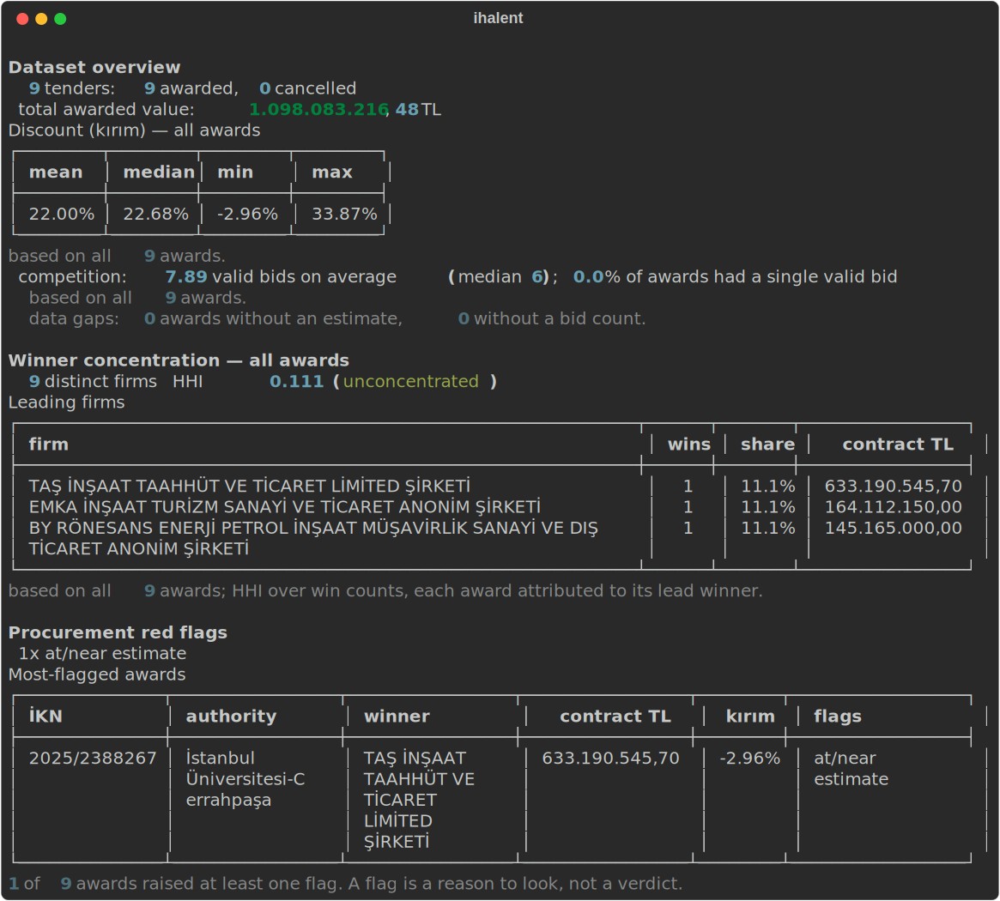

# ihalent

**Turkish public-tender award intelligence: who won, for how much, at what discount, against how many bidders.**

[](https://github.com/gulmezeren2-byte/ihalent/actions/workflows/ci.yml)
[](pyproject.toml)
[](LICENSE)

> Built on top of **[saidsurucu/ihale-mcp](https://github.com/saidsurucu/ihale-mcp)** — ihale-mcp reaches EKAP; ihalent structures and analyzes what it returns.

<!-- mcp-name: io.github.gulmezeren2-byte/ihalent -->

Every public tender in Turkey ends with a *Sonuç İlanı* — a result notice that states the
estimate, the contract price, the winner, and how many firms bid. The notices are public.
They are also one at a time, unstructured, and impossible to reason across: you cannot ask
EKAP "what has this company won in the last two years" or "how far below estimate does this
authority actually award." ihalent turns those notices into structured records and answers
exactly those questions — firm histories, discount (kırım) distributions, and competition
metrics — with every number traceable back to the notice it came from.



That is real output over nine real December-2025 construction awards (in
[`examples/`](examples/)). The `-2.96%` at the top of the range is not a bug: Istanbul
University awarded a 615-million-lira campus job at **2.96% above** its own estimate,
through an emergency "pazarlık" procedure — a contract signed over the public estimate,
which is precisely the kind of thing that should be easy to see and currently is not.

## Why this exists

I'm an industrial engineer and I work in construction. When our firm weighs a public
tender, the questions that decide the bid are all about other people's history: how far
below estimate does this authority award, how many firms usually show up, what has a given
competitor been winning and at what price. All of that is public — it is sitting in tens of
thousands of result notices on EKAP — and none of it is queryable. So everyone rebuilds a
private, partial version of it by hand, in spreadsheets, badly.

There is already an excellent tool for *reaching* this data:
[saidsurucu/ihale-mcp](https://github.com/saidsurucu/ihale-mcp) solved authenticated EKAP
access and hands you the notices. ihalent is the layer above it — the one that turns a pile
of notices into an answer. It does not re-scrape EKAP; it structures what you have collected
and does the analytics that don't exist yet.

## What it answers

**A firm's history** — every award across the dataset, folded across spelling variants:

```
$ ihalent firm awards.jsonl "ÖZDEN YEL"

ÖZDEN YEL
  wins: 1   joint ventures: 1   total contract value: 19.709.997,40 TL
  Discount (kırım): mean 33.87%
  top awarding authorities:
      1x  DSİ 14. Bölge Müdürlüğü
```

**Where the discounts are** — grouped and sorted, highest first:

```
$ ihalent discounts awards.jsonl --by authority

Mean discount by authority
  DSİ 14. Bölge Müdürlüğü            33.87%   1/1
  Esenler Belediyesi                21.99%   1/1
  Ağrı İl Özel İdaresi              19.99%   1/1
  İstanbul Üniversitesi-Cerrahpaşa  -2.96%   1/1
```

**Competition** — how many valid bids show up, and how often exactly one does (a single-bid
award is a flag procurement watchdogs care about). It's in the overview above.

## The one rule

**A number is never shown without the ground it stands on.** A mean discount always comes
with "over how many awards, and how many were dropped for a missing estimate." A firm's
total contract value says so when some of its wins had no published price, so you read it as
a floor, not the full figure. A discount is `None`, never `0`, when the estimate wasn't
published — ihalent does not invent the numbers the government didn't print. Half the value
of a tool like this is refusing to guess.

## Install

```
pip install ihalent           # add [mcp] for the MCP server: pip install "ihalent[mcp]"
```

Or from source: `pip install git+https://github.com/gulmezeren2-byte/ihalent`.

## The workflow

ihalent reads a JSONL file of awards. You produce it by collecting result notices — the
easy path is ihale-mcp — and letting ihalent structure them:

```
# 1. collect: with ihale-mcp connected to your agent, save what its
#    get_tender_announcements returns (one or many tenders) to bundle.json

# 2. structure:
ihalent ingest bundle.json -o awards.jsonl

# 3. ask:
ihalent overview  awards.jsonl
ihalent firm      awards.jsonl "ACME İNŞAAT"
ihalent discounts awards.jsonl --by province --min 5
```

Every command takes `--json` for pipelines and agents. Or skip collection and try the
bundled example directly:

```
git clone https://github.com/gulmezeren2-byte/ihalent && cd ihalent
python examples/build_sample.py       # parses the real notices in examples/notices/
ihalent overview examples/sample-awards.jsonl
```

## Commands

| command | what it does |
|---|---|
| `ihalent overview AWARDS` | value, discount, competition and the data gaps of a dataset |
| `ihalent firm AWARDS "NAME"` | one company's wins, total value, discount, and where it wins |
| `ihalent discounts AWARDS --by X` | mean/median discount grouped by authority, province or tender_type |
| `ihalent single-bid AWARDS` | awards with a single valid bid — no real competition (a watchdog flag) |
| `ihalent concentration AWARDS [--authority X]` | winner concentration (HHI) — do the same few firms win everything? |
| `ihalent flags AWARDS` | per-award red flags: single bid, near-estimate price, no estimate, high drop-off |
| `ihalent parse NOTICE.md` | one result notice → structured JSON |
| `ihalent ingest BUNDLE.json` | collected ihale-mcp/EKAP output → awards JSONL |

## Using it with AI agents

The result notice is unstructured text; the interesting questions are aggregate. That is an
awkward fit for an agent working notice-by-notice, and a natural fit for a tool: `--json`
output with stable fields, an exit code that means something, and a firm-name match that
folds spelling variants so an agent doesn't have to.

There is a native **MCP server** (`pip install 'ihalent[mcp]'`) that exposes the analytics
as tools — `overview`, `firm`, `discounts`, `concentration`, `flags`, `parse_notice`,
`ingest_bundle` — over a dataset you point it at:

```
IHALENT_AWARDS=awards.jsonl ihalent-mcp
```

No local Python? The [`Dockerfile`](Dockerfile) builds the same server:
`docker build -t ihalent . && docker run --rm -i -e IHALENT_AWARDS=/data/awards.jsonl -v "$PWD:/data:ro" ihalent`.

Pair it with ihale-mcp and an agent can collect notices and reason across them in one
session: ihale-mcp fetches, ihalent structures and aggregates. The Python API
(`ihalent.ingest_bundle`, `ihalent.analytics.firm_profile`) is three calls deep if you'd
rather script it.

## Scope, honestly

- **This is analytics, not a scraper.** Collection is ihale-mcp's job (it does it well);
  ihalent deliberately owns the layer above and stays a pure function of the data you give
  it — no network, no signing keys, nothing that breaks when EKAP rotates a header.
- **Company-name folding is conservative on purpose.** It merges legal-form suffixes and
  Turkish spelling variants, and it would rather show two rows for one firm than one row for
  two — so `firm` reports how many distinct spellings a query matched, and warns you if that
  is more than one.
- **The parser tracks one document: the result notice.** Bid-level detail (who else bid, at
  what price) is not in the notice and so is not here. Discount is the estimate-to-contract
  gap, which the notice does carry.
- **Award values are nominal lira, as printed.** Comparing 2023 and 2026 contracts is your
  analysis to make with the dates in hand; ihalent does not silently inflation-adjust.

## What ihalent is not

It is not a replacement for [ihale-mcp](https://github.com/saidsurucu/ihale-mcp) — it sits
on top of it. It is not a live dashboard or a paid tender-alert service; it is a library and
a CLI you point at data you control. And it does not redistribute a dataset: it ships the
handful of real notices in `examples/` and the code to structure your own.

## A note on the data

Public-tender results are public information, published by the state for public scrutiny.
ihalent structures what EKAP already discloses. Company names that appear are legal entities
in their public commercial capacity, not private individuals.

## How this project is built

I designed the model and the analytics and I review every line; I use AI agents (Claude
Code) heavily for implementation speed, and the commit trailers say so. The contract is the
tests — 44 of them, built on the exact JSON shapes EKAP and ihale-mcp emit, including a
result notice with a negative discount and a cancelled tender. They don't care who typed
them.

## License

[MIT](LICENSE) — Mehmet Eren Gülmez
